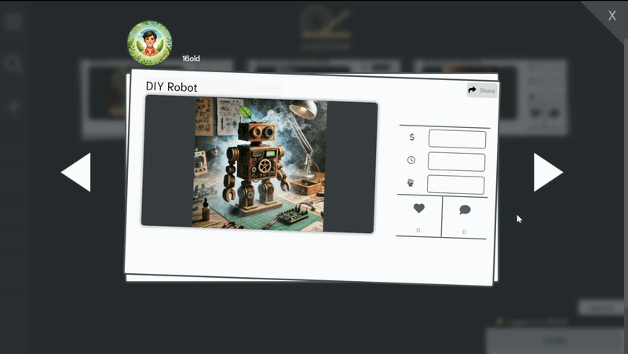

# Reoptinew

 

## Table of Contents

- 🗺️ [Project Map](#map)
- 💡 [Introduction](#introduction)
- ⭐️ [Features](#features)
- 🌐 [API](#api)
- 🎨 [UX-Design](#ux-design)
- 📉 [Agile](#agile)
- 🧬 [Cloning the repository](#cloning-the-repository)
- 🍴  [Forking the repository](#forking-the-repository)
- 🏃‍♂️ [Run the App](#run-the-app)
- ☁️ [Deployment with Github Actions](#deployment-with-github-actions)
- ❌ [Error handling](#error-handling)
- 🛠️ [Technologies](#technologies)
- ⛔️ [Known Issues](#known-issues)
- 🔧 [Testing](#testing)
- 🌌 [Philosophy](#philosophy)
- 🖥️ [Code Documentation](#code-documentation)
- ✨ [Credits](#credits)
- 🖊️ [References](#references)

## Project Map 

The "map" below provides an overview of key resources in this project. 

#### External resources

- 🖥️ [Live web app](https://reoptinew-09d333f23d8e.herokuapp.com/)  
- 🌐 [API Repository (with documentation)](https://github.com/KevinBjarnemark/reoptinew-api)  

#### Documentation

- 📉 [First iteration](docs/iteration-1/README.md)  
- 📉 [Sprints](docs/iteration-1/sprints)  
- 📃 [GitHub Projects (Kanban)](https://github.com/users/KevinBjarnemark/projects/10).

## Introduction

**Reoptinew** is a library of **new ideas**, **crafts**, **life-hacks**, and **more**. Big ideas and small ideas, **all are welcome!** 💡

If you tick any of the boxes below, you might feel right at home when visiting **Reoptinew**.

You want to:   
- explore DIY crafts
- share life-hacks like washing dishes like a pro, or make your own potato chips
- showcase advanced builds like soapboxes or homemade robots
- find something to do on a Saturday afternoon
- discover alternative ways of doing everyday stuff
- find a solution to a specific problem

A couple of wooden boards. A metal wire. An old wheel from a discarded bicycle. To most, these are scraps, forgotten, insignificant, not worth a second thought. But to a mind trained to see potential, these are the seeds of something greater. At **Reoptinew** you see the extraordinary in the ordinary and get to be a part of it too. Share your own builds and follow your favorite crafters at **Reoptinew**.

### Goals

Reoptinew aims to:

- Provide a curated space for innovative DIY projects, life-hacks, and creative builds.
- Enable users to share and discover alternative solutions to everyday challenges.
- Foster a community where people can learn, create, and inspire each other.
- Encourage sustainability by repurposing materials and rethinking conventional approaches.

## API

The Reoptinew web app uses a decoupled architecture, separating the frontend and backend repositories. The **backend API repository** can be found [**here**](https://github.com/KevinBjarnemark/reoptinew-api). 

## React and Reusability

The philosophy of building for reusability with React has deeply been followed. To showcase this, let's start with the `<Post />` component. 

The `<Post />` component with all its related components is a single component whether it's viewed enlarged, iterated as smaller posts, in edit mode, or however else. This ensures a seamless system that transfers to all areas of the app. An update applied to the `<Post />` component will cause a ripple-effect of updates throughout the app. This not only saves time in the long run, it also provides continuity and theme.

Reoptinew's components are not all fully reusable, this is partly due to the time constraint of the project, but also to maintain a balance of flexibility and practicality. Forcing some components into a reusable structure could introduce more overhead than efficiency in some cases. Especially in a project like this where every component is brand new and designed from scratch. By not over-engineering reusability from the start, the project remains open to adaptation and change as new needs arise.

## Features

### Loading Spinner

The app is equipped with a loading spinner that tracks various processes, including backend operations, general computing loads, and queued tasks. It adapts based on system activity and transitions into a notification system to indicate successful or failed results. This keeps the user aware of the status of the app by providing real-time feedback. The spinner is in itself fused with the Reoptinew logo to enhance brand awareness.

 

### Create and Edit Posts

The post component is a single component and has many forms. It can be loaded and iterated in the feed, displayed in edit mode, and create mode.

 

Click on the **ellipsis menu button** to edit a post.

 

### Add Materials and Tools

Add and remove materials and tools in an intuitive way.

 

### Submit Posts

Here we're showcasing how to submit a post. Any dangerous materials and tools can be added too. When a post is considered to be harmful for children it will only be visible to mature authenticated users.

 

### Follow/Unfollow

 

### Comments and Likes 

 
 

### Rate Posts

Rate posts based on multiple factors. 

 

### URL-Based Rendering (for sharing)

Here we're showcasing the URL-based rendering. URLs are not only aware of which post to fetch, but also in which context. If you want to share a post, but also want it displayed on the author's profile, share it from their profile page!

 

### Age-Restricted Posts

#### Backend Integrated

Age-restricted posts will only be sent to the frontend if the user is mature and authenticated. Here we're showcasing this by copying the URL as a mature user, re-authenticating as an in-mature user, and then navigating to that same URL. 

 

#### +16 Labels

You will only see these labels if you're authenticated and older than 16. The safety card is only visible in edit mode. This is to enhance the user experience and to keep the app minimalistic. Click on the +16 label to see if the build is harmful in any way.   

 

#### Restricted Fetching

You must be authenticated and older than 16 to load age-restricted posts.

 

### More features:

- Delete Account
- Search and Filter Posts
- Alerts and Notification System

## UX-Design

### Initial Design 🎨

The design of this app was originally crafted using illustrations and vector editing tools to explore how the components could coexist.


### Logo and brand name


**Reoptinew**:

- **Re:** as in redo, reimagine, rebuild, remake, etc,.
- **opt:** as in optimize.
- **i:** as in "I" or "me".
- **new:** Represents something new, novel, or unseen.

The Reoptinew logo is designed to inspire users to build something new. The "R" reclining on its back 
symbolizes ingenuity and simplicity, something that feels tangible and achievable, much like a crafted solution to a practical problem.

The logo features a minimalistic design with clean, clear shapes, ensuring easy recognition even at smaller sizes. Whether displayed as a bookmark or seen at a distance, its simplicity enhances visibility and memorability.

#### Strategic placement 

The Reoptinew's logo has a fixed position at the top as users scroll. 

This is a strategic approach that provides several benefits:

- **Brand Recall:** The constant visibility of the logo ensures that users are consistently reminded of Reoptinew’s identity, strengthening their association with the app.

- **Screenshots as Marketing:** When users take screenshots for sharing or reference, the fixed logo will enhance brand recognition. This creates organic opportunities for promotion when screenshots are shared on social media or with others.

This thoughtful approach makes the logo not only a symbol of the app but also a functional tool for branding and user engagement.

### Central Content Placement

The thought process behind the placing of elements has been influenced by a [medium article](https://medium.com/@hayavuk/ui-ux-design-fundamentals-for-the-front-end-developers-688ba43eaed4) shared by [Hajime Yamasaki Vukelic](https://medium.com/@hayavuk). This article explains widely recognized design standards used to draw the user's attention effectively. 

For example, the post visible in the feed is emphasized by being placed prominently and slightly elevated on the screen. This strategic layout aligns with familiar user expectations and is proven to direct attention.

### Exploration, Engagement, and Contrast 

The stacking of cards within the interface invites users to explore further, tapping into a fundamental human curiosity, our intrigue with the unknown. This design element mimics the timeless metaphor of waving an empty fist to a child, igniting curiosity about what lies within, only to later reveal it empty-handed. This playful interaction captures the essence of discovery, enticing users to uncover the more "hidden" within the app.

The dark background combined with white cards ensures sharp contrast. This technique aligns with [Gestalt principles](https://www.interaction-design.org/literature/topics/gestalt-principles?srsltid=AfmBOopo24IttjTdh5gS7TBtJD96vAoGnYgzmxstOmXZKEjgCqhliGe0) of visual design, where contrast creates focus and separates key elements from the surroundings.

### Consistency and Sizing

Reoptinew’s minimalistic interface have been designed with a clean, universal design ethos. 

- Common icons such as the magnifying glass for search and the hamburger menu for navigation are used, providing an intuitive user experience.
- Navigation menu and sidebar tools are easily accessible and within reach as the user scrolls on the page.
- Titles and key text elements are larger and bold to attract immediate attention.
- Supporting details, such as user interaction counts, are smaller but remain highly visible, ensuring a clear flow of information.

### Texture

Try to think of anything in the natural world that is entirely devoid of texture and uniformly single-colored. Even snow possesses a subtle texture, and the sky is adorned with clouds and shifting gradients of color. Due to this observation, large elements are equipped with either interactive components or textures. For instance, the page background incorporates circular patterns that add depth and resolution without overwhelming or distracting the user. Moreover, the pattern texture is mimicking parts of the logo to subliminally reinforce brand identity.

### Minimalistic approach

The design embraces minimalism to create a distraction-free, efficient user experience. Posts have a clean, card-like design that separates content neatly, making it easy for users to digest information without visual clutter. A dual search system, with options for simple or filtered searches, creates a simplistic view for both casual users and power users.

### Keep the user informed

Features, such as the "Logged in as Joe" indicator, keep the user informed about the status of the app. This is a strategic design originated from [Jakob Nielsen](https://www.nngroup.com/people/jakob-nielsen/) who emphasized that the user should constantly be informed about the status of the app. 

### More

- The design facilitates scalability by leaving ample room for future features without overloading the current design.

## Agile

The Reoptinew project has been developed using an **Agile methodology** with only a single iteration so far. In-depth documentation for the first iteration, its sprints, diagrams, and more can be found [here](docs/iteration-1).

## Cloning the repository 

To explore, develop, or experiment with this project, you can clone the repository to create a local copy. Cloning allows you to contribute, test new features, or modify the project within your own environment.

#### Steps to clone

Before cloning, ensure you have [Git](https://git-scm.com/) installed on your system.

1. Navigate to the repository on GitHub.
2. Click on the green Code button.
3. Copy the repository URL (choose HTTPS, SSH, or GitHub CLI as preferred).
4. Open your terminal or command line and type

```bash
git clone <repository-url>
```

5. Navigate into the project directory:
```bash
cd reoptinew
```

## Forking the repository 

Forking allows you to create your own version of the repository under your GitHub account. This is useful for personalizing the project and proposing changes.

#### Steps to fork

1. Navigate to the repository on GitHub.
2. Click on the Fork button at the top right corner of the page.
3. The repository is now available in your GitHub account.
4. Clone your forked version using the cloning steps outlined above.

Once you've forked and cloned, feel free to explore and enhance the project! Check out the [README.md](README.md) for guidance on running the project locally.

## Run the App

After [Cloning](#cloning-the-repository) or [forking](#forking-the-repository) the repository, you are almost ready to run the app. Follow the steps below.

- Configure environment variables
    - Create **3** `.env` files with the following content.
        - `.env`
            - This can remain empty, for now. You may add variables here as the project grows. 
        - `.env.production`
            ```bash
            # This is the URL to your deployed API.
            VITE_API_URL=https://<your-deployed-api>.com
            ```
        - `.env.development` 
            > ❕ **Info**  
            > If you don't know your IP Adress, simply run `ipconfig` in the terminal and copy the `IPv4 Address`. 
            ```bash
            # This is a security feature
            VITE_API_HOST=<your IP Address>
            # This connects to the API that runs locally on port 8000 
            VITE_API_PORT=8000
            ```

- Go to the project directory.
    ```bash
    cd reoptinew
    ```
- Install dependencies
    ```bash
    npm install
    ```
- Run the app
    ```bash
    npm run dev
    ```

## Deployment with Github Actions

If you want to mimic Reoptinews's way of deploying the app, you need to first create a [Heroku](https://www.heroku.com/) account. Follow the steps below if you're unfamilliar with Heroku.

1. #### Create the Heroku App
    - Click `New` and then select `Create new app`. 
    - Follow the instructions.
    - Go to the `Settings` tab.
    - Add buildpacks
        - `Node.js` is used in this project

2. #### Find the Heroku API Key
    - Log in to [Heroku](https://www.heroku.com/)
    - Click on the account button (upper right corner)
    - Click on your name
    - Scroll down and reveal your API key
    > ⚠️ **NOTE**  
    > This is not supposed to be shared with anyone. Do not expose this key in the live GitHub repository.

#### Now you have:   
✔️ A Heroku account  
✔️ A Heroku app   
✔️ The Heroku API key  

You should now be ready to configure a `CI/CD pipeline` to automate the deploying process. We use a `CI/CD pipeline` to make sure the app is propely tested before publishing a new version. **Continue reading to find out how to configure such system.**

### GitHub Actions

In order to automate the deploy process we'll use GitHub Actions.  

> ⚠️ **NOTE**  
> When setting up a GitHub workflow, you must allow GitHub to perform the following actions:  
> - Execute read and write actions within GitHub Actions.  
> - Access and utilize your environment secrets.  

To enable this setup, configure a GitHub workflow by adding a [deploy.yml](.github/workflows/deploy.yml) file inside `.github/workflows`. 

Additionally, you need to submit your environment secrets to GitHub.

1. Navigate to your repository.
2. Click on settings
3. Select `Actions` under the `Secrets and variables tab`.
4. Click on `Add new repository secret`. 

Once your [deploy.yml](.github/workflows/deploy.yml) is correctly configured, deployment becomes as simple as tagging a new version and pushing the tagged project.

> ❕ **Info**  
> As you may have noticed, testing is also included in the `CI/CD pipeline` ([deploy.yml](.github/workflows/deploy.yml)), please reference the [Automated Testing](#automated-testing) section if you're unfamilliar with how to set this up.

Before proceeding, it's worth noting that you might want to push normally before deploying a new version. 

1. Create a tag
    - **`git tag v0.1`**
2. Push the new version
    - **`git push origin v0.1`**

If everything is set up correctly and if all your steps/tests pass, the project should be deployed to Heroku. You can follow the process by navigating to the `Actions` tab on GitHub.


## Error handling

> ❕ **Note**  
> The error-handling system in Reoptinew seamlessly handles both frontend and backend errors. For a detailed overview of backend error handling, refer to the [**backend repository**](https://github.com/KevinBjarnemark/reoptinew-api).

Reoptinew gracefully manages errors across the application by wrapping critical functions in try-catch blocks at multiple levels. This ensures errors, whether expected or unexpected, are captured and handled consistently. Unexpected errors are displayed as `Something went wrong`, preventing confusing or technical error messages from disrupting the user experience. All error messages are carefully reviewed, approved, and tailored to improve clarity and usability.
 
### Alert window

All types of errors and notifications are displayed in the [Alert Window](src/components/alerts/alert-window/AlertWindow.jsx). The strongest feauture of this component is that it allows errors to be thrown across the app without overwhelming the user, or erasing previous data. The user is fully informed about the **status of the app** and is able to toggle between the fired alerts/errors in the order they were thrown. All alerts/errors will be removed from memory when the user closes the alert window, this improves the user experience, increases performance, and provides control.   

> ⛔️ **Known issue**   
> Alerts may occasionally appear out of chronological order due to how React processes rendering queues. Although this can be resolved with useRef, the issue is minor and currently not prioritized.  

Moreover, the alert system follows a modern, non-intrusive design with engaging animations and intruiging colors to further enhance the UX. When an alert/error is executed or toggled, a strong color that matches the alert/error-type will flash to gain the user's attention.

## Technologies

Read more about the programming languages, frameworks, and tools used to build **Reoptinew** in this section.

<details>
    <summary>
        Vite
    </summary>

**A build tool designed for modern web development.** 

Vite optimizes production builds with ESBuild and Rollup. It also offers Hot Module Replacement (HMR) which enables instant updates to specific parts of your application during development, without requiring a full page reload.

</details>

<details>
    <summary>
        Bootstrap
    </summary>

**A CSS framework for responsive web design.** 

Bootstrap provides a collection of CSS utilities, components, and a responsive grid system to streamline front-end development. This project exclusively uses Bootstrap’s CSS utility classes to achieve consistent styling and layout, without relying on its prebuilt components or JavaScript.

</details>

<details>
    <summary>
        Jest
    </summary>

**A JavaScript testing framework.** 

Jest is commonly used for testing JavaScript and TypeScript code. It includes features for mocking, snapshot testing, and generating coverage reports. It is compatible with a variety of libraries and frameworks and supports both unit and integration tests.

</details>

<details>
    <summary>
        jwtDecode
    </summary>

**A utility for decoding JSON Web Tokens.**

jwtDecode is a lightweight library used to decode the payload of a JSON Web Token (JWT) without validating its signature. It can be used to extract claims or information embedded within the token.

</details>

</details>

<details>
    <summary>
        Prettier
    </summary>

**Code formatter** 

Prettier ensures consistent code formatting by parsing the code with default and customized formatting rules. It supports a wide range of languages, including JavaScript, TypeScript, HTML, CSS, JSON, and more. Prettier integrates seamlessly with editors. Here's this project's configuration file for it [Configuration file](.prettierrc).

</details>

<details>
    <summary>
        React Testing Library
    </summary>

**A lightweight library for testing React components** 

React Testing Library focuses on testing components as users interact with them, rather than testing implementation details. It encourages best practices by querying the DOM in ways that simulate real user actions and accessibility standards.

</details>

<details>
    <summary>
         Identity Obj Proxy
    </summary>

**A Jest utility for mocking CSS Modules in JavaScript tests.**

This library simplifies testing components that rely on CSS Modules by mapping class names to their string equivalents. This ensures CSS imports in your tests don’t break and allows you to verify that the correct class names are applied without worrying about the actual CSS.

</details>

## Known Issues

Let's list some known issues that should be prioritized. 

 
⛔️ **Post Pagination**   
Right now all posts are returned to the user. This is a serious issue and should be easy to implement, given the current systems in place. 

⛔️ **Flexible Image system**  
> ⚠️ **NOTE**  
> A temporary fix has been applied here to enable users to still use all the app's features.  
More info below.  

While users are able to upload and change their images, there is a problematic scenario that should be fixed ASAP.  

**Here's how to test it.** 

1. Create a post with a custom image
2. Edit the post without uploading a new image
3. Submit edit

What would happen here is that the back end would receive a URL (str) while it expects a file. This error occurs early, before entering the serializer (in the model itself). 

**Potential solution:**  
An edit request should be a PATCH request and only update the fields that have changed. 

**Temporary fix:**  
This fix has been applied in the frontend. The system detects this flow of events and does the following:

1. Displays warnings to the user that their image will be deleted if they submit the edit. 
2. If the user submits the edit, the image will be removed from the request (frontend) and deleted in the backend. This is because the user might have chosen a default image and expected their previously selected image (if they had one) to be discarded.

**Summary**  
The app still has all features available but with some drawbacks in terms of user experience.

⛔️ **Cloudinary Image Removals**  
When a user e.g,. changes their profile image, the image won't be cleared in Cloudinary. This problem should be fixed ASAP to clear unnecessary data and to provide a flawless automatic system.

## Testing

### Manual Testing

#### 📱 Testing on Physical Devices

Ensuring **Reoptinew** delivers a seamless experience across devices is a critical part of development. The following section outlines the methods and tools used for responsive design testing, including media queries and Vite-specific optimizations.

#### Configuration

To mimic a similar setup as Reoptinew, some configuration is needed. 

- **Bind Server to Local Network's IPv4 Address**

First we'll need to enable other devices to access your network and app by binding the server to your local network's IPv4 address.

> ⚠️ **NOTE**  
>Binding to your private IPv4 address (e.g., 192.168.x.x) means only devices on the same local network can access it. This is generally safe for testing.
>
>However, binding to 0.0.0.0 listens on all interfaces, which could expose the server to unintended connections if you're on an unsecured or public network. Never expose .env files containing sensitive information like API keys or credentials.

In this repository, the local development IP is stored in [.env.development](.env.development) (not publicly visible). If you store yours as an environment variable, it should be configured in [vite.config.js](vite.config.js) like in the example below.

```js
server: {
    host: env.VITE_API_HOST,
    port: 5173,
},
```

- **Backend setup**

In the backend, when running the development server locally, the following environment variables ensure accessibility from various devices within the network.

> ❕ **Note**
> You cannot have both the API and frontend on the same port, in our case, the `DEV_SERVER_HOST` is set to `8000`.   

```python
# settings.py
dev_server_host = config("DEV_SERVER_HOST")
dev_server_frontend_port = config("DEV_SERVER_FRONTEND_PORT")

if DEBUG:
    # Allow localhost in development
    CORS_ALLOWED_ORIGINS = [
        f"http://{dev_server_host}:{int(dev_server_frontend_port)}"
    ]
    ALLOWED_HOSTS = [dev_server_host]
else:
    # Allow the deployed frontend in production
    CORS_ALLOWED_ORIGINS = [
        "https://reoptinew-09d333f23d8e.herokuapp.com",
    ]
    ALLOWED_HOSTS = ["reoptinew-api-c16dc2520739.herokuapp.com"]
```

- **Test on a mobile device** 

Open the development app on mobile via `http://{VITE_API_HOST}:5173/`.

#### Test cases

##### Users

| **Test Case ID** | **Feature** | **Test Steps** | **Expected Result** | **Actual Result** | **Pass/Fail** | **Explanation** |
|------------------|------------|---------------|--------------------|------------------|-------------| ------------|
| TC-001 | **Login** | 1. Enter valid credentials <br> 2. Click login button | User should be logged in | User logs in successfully | ✅ Pass | |
| TC-002 | **Login - Invalid Credentials** | 1. Enter incorrect email/password <br> 2. Click login button | "Invalid credentials" error should appear | Error message appears | ✅ Pass | |
| TC-003 | **Signup** | 1. Enter valid details <br> 2. Click signup button | User should be registered and redirected to /profile/**username** | User successfully registered | ✅ Pass | |
| TC-004 | **Signup  - Invalid Credentials** | 1. Enter valid details using a username with lowercase (eg. testUser) <br> 2. Log out and create another user with uppercase (eg. TestUser) | The following error should appear "This username is already taken" | The "This username is already taken" error appears | ✅ Pass | Since url-based rendering is in place, usernames must be case-sensitive. Otherwise, profile pages would collide. |
| TC-005 | **CRUD - Delete Account** | 1. Log in <br> 2. Go to /profile/**username** <br> 3. Click Delete account button <br> 4. Confirm password <br> 5. Click delete account button | 1. User should be directed to the homepage (/) <br> 2. Confirmation message should confirm that the account is deleted 3. User should be logged out | 1. User is directed to the homepage (/) <br> 2. Confirmation message appears and confirms that the account is deleted <br> 3. User is logged out | ✅ Pass | |
| TC-006 | **CRUD - Change Profile Picture** | 1. Log in <br> 2. Go to /profile/**username** <br> 3. Click on the profile image <br> 4. Select another image <br> 5. Refresh the browser | The new image should be visible after selecting it and after the browser refresh | The new image was visible after selecting it and still visible after a browser refresh | ✅ Pass | |
| TC-007 | **Follow** | 1. Log in <br> 2. Go to a user's profile <br> 3. Click "Follow" <br> 4. Click "Followers" | 1. The follow button should transform into an orange unfollow button <br> 2. The followed user should experience a follow increase <br> 3. When opening the followers window, the currently logged in user should appear in the list | 1. The follow button transformed into an orange unfollow button <br> 2. The followed user experienced a follow increase <br> 3. When opening the followers window, the currently logged in user appeared in the list  | ✅ Pass | |
| TC-008 | **Unfollow** | 1. Log in <br> 2. Go to a user's profile who is already followed <br> 3. Click "Unfollow" <br> 4. Click "Followers" | 1. The unfollow button should transform into a blue follow button <br> 2. The followed user should experience a follow decrease <br> 3. When opening the followers window, the currently logged in user should not appear in the list | 1. The follow button transformed into a blue follow button <br> 2. The followed user experienced a follow decrease <br> 3. When opening the followers window, the currently logged in user did not appear in the list  | ✅ Pass | |


##### URL-based rendering
| **Test Case ID** | **Feature** | **Test Steps** | **Expected Result** | **Actual Result** | **Pass/Fail** | **Explanation** |
|------------------|------------|---------------|--------------------|------------------|-------------| ------------|
| TC-001 | **Post (profile page)** | 1. Go to a user's profile (eg. /profile/**testUser**) <br> 3. Click on a post <br> 4. Copy the url <br> 5. Open another tab and paste the url <br> 6. Press enter <br> 7. Close the post | 1. When navigating to the copied URl, the previously viewed post should appear <br> 2. After closing the post, the user should be located at /profile/**testUser** | 1. When navigating to the copied URl, the previously viewed post appeared <br> 2. After closing the post, the user was located at /profile/**testUser** | ✅ Pass | |
| TC-002 | **Post (feed)** | 1. Go to the main feed (/) <br> 3. Click on a post <br> 4. Copy the url <br> 5. Open another tab and paste the url <br> 6. Press enter <br> 7. Close the post | 1. When navigating to the copied URl, the previously viewed post should appear <br> 2. After closing the post, the user should be located at the main feed (**/**) | 1. When navigating to the copied URl, the previously viewed post appeared <br> 2. After closing the post, the user was located at the main feed (**/**) | ✅ Pass | |
| TC-003 | **User profiles** | Navigate to a user's profile you know exists (eg. /profile/**testUser**) | The user's profile should appear| The user's profile appeared | ✅ Pass | |


##### 🛡️ Age restriction
| **Test Case ID** | **Feature** | **Test Steps** | **Expected Result** | **Actual Result** | **Pass/Fail** | **Explanation** |
|------------------|------------|---------------|--------------------|------------------|-------------| ------------|
| TC-001 | **Signup** | 1. Enter valid details but with a birthdate younger than 13 <br> 2. Click signup button | Error should appear, telling the user they must be older than 13 to proceed | Error appears, telling the user must be 13 years or older | ✅ Pass | |
| TC-002 | **View Post (URL)** | 1. Log in as a user older than 16 years old <br> 2. Click on a post that is age restricted <br> 3. Ensure the +16 label is present <br> 4. Copy the url (eg. /posts/post/150) <br> 5. Log out. 6. Navigate to the previously copied URL. | Error should appear telling the user they must be older than 16 to create, edit and view post. The post should not be fetched or loaded in the app. | Error appeared telling the user they must be older than 16 to create, edit and view post. The post was either fetched or loaded in the app. | ✅ Pass | |
| TC-003 | **View Post (feed)** | 1. Log in as a user older than 16 years old <br> 2. Click on age-restricted posts <br> 3. Ensure there is a 16+ label present. <br> 4. Re-authenticate with a user younger than 16 years old. <br> 5. Click on the posts that loads in the feed | 1. Age-restricted posts loaded by the older user should include a  +16 label. <br> 2. No age-restricted posts should load when logged in as the younger user.| 1. Age-restricted posts loaded by the older user had a +16 label. <br> 2. No age-restricted posts loaded when logged in as the younger user. | ✅ Pass | |
| TC-004 | **Create Post** | 1. Log in as a user younger than than 16 years old <br> 2. Click on the "+" button and "Create post" <br> 3. Toggle to the safety card <br> 4. Enter valid details but also add any of the following: <br> Dangerous outcome <br> Harmful materials <br> Harmful tools. <br> 4. Toggle the submit card and click Submit. | Error should appear telling the user they must be older than 16 to create, edit and view post | Error appeared telling the user they must be older than 16 to create, edit and view post | ✅ Pass | |


##### Posts

| **Test Case ID** | **Feature** | **Test Steps** | **Expected Result** | **Actual Result** | **Pass/Fail** | **Explanation** |
|------------------|------------|---------------|--------------------|------------------|-------------| ------------|
| TC-001 | **CRUD - Create Post** | 1. Log in <br> 2. Click on the "+" button and "Create post" <br> 3. Toggle the last card and click "Submit" | Post should be created and visible on feed | Post successfully appeared in the feed | ✅ Pass | |
| TC-002 | **CRUD - Edit** | 1. Log in <br> 2. Click on a post previously ceated by the currently logged in user <br> 3. Click the ellipsis menu and then "Edit post" <br> 4. Edit the post details | Post should be updated and visible | Post updates successfully | ✅ Pass | |
| TC-003 | **CRUD - Like** | 1. Log in <br> 2. Click on the like button <br> 3. Click on the like button again | The like button should toggle on/off indicated by a increment/decrement in likes count and color change | The like button toggled on/off and indicated an increment/decrement in likes count and color change | ✅ Pass | |
| TC-004 | **CRUD - Comment** | 1. Log in <br> 2. Click on a post <br> 3. Click on the comment button <br> 3. Write a comment <br> 4. Click "Publish comment" <br> 5. Click on the comment button again | 1. When publishing the comment, the window should close and a successful confirmation message should appear. The comment count should also increase <br> 2. When opening the comment window again, the comment should appear in view | 1. When publishing the comment, the window closed and a successful confirmation message appeared. The comment count increased <br> 2. When opening the comment window again, the comment appeared in view | ✅ Pass | |
| TC-005 | **CRUD - Rate** | 1. Log in <br> 2. Click on the rating panel <br> 3. Enter ratings <br> 4. Click "Submit" | Post should be updated in the feed with applied ratings | Post was updated in the feed with the ratings applied | ✅ Pass | |
| TC-006 | **CRUD - Delete** | 1. Log in <br> 2. Click on a post previously ceated by the currently logged in user <br> 3. Click the ellipsis menu and then "Delete post" <br> 4. Click "Delete" in the confirmation window | Post should be deleted and not visible in the feed and a successful confirmation message should appear | Post removes and is not visible in feed, a successful confirmation message appears | ✅ Pass | |
| TC-007 | **CRUD - Share** | 1. Load a post, either in the main feed or ao a user's profile. <br> 2. Paste the url in the browser | The previously viewed post should appear | The previously viewed post appeared | ✅ Pass | |
| TC-008 | **CRUD - Custom Image (EDGE CASE)** | 1. Log in as a user who've created post(s) with custom images. <br> 2. Enter edit mode for a post with a custom image <br> 3. Change details leaving the custom image as is. <br> 4. Toggle to the submission card | When toggling to the submission card a warning message should appear telling the user that editing without uploading a new image is not supported, a submission will result in a deleted image | When toggling to the submission card a warning message appears telling the user that editing without uploading a new image is not supported. The warning also inform that submission will result in a deleted image | ✅ Pass | |
| TC-009 | **Search - Find Post(s)** | 1. Click on "search" <br> 2. Enter text that an already visible post has in their title <br> 3. Click the magnifying glass button | Only posts that include the text previously searched for should appear | Only posts that include the text previously searched for appeared | ✅ Pass | |
| TC-010 | **Search - Filter by date** | 1. Click on "search" <br> 2. Open the "Sort by" dropdown <br> 3. Click "Date" <br> 4. Click the magnifying glass button | Posts should be sorted from newest to oldest | Posts correctly sorted by date | ✅ Pass | |
| TC-011 | **Search - Filter by likes** | 1. Click on "search" <br> 2. Open the "Sort by" dropdown <br> 3. Click "Likes" <br> 4. Click the magnifying glass button | Posts should be sorted from most to least likes | Posts correctly sorted by like count | ✅ Pass | |
| TC-012 | **Search - Filter by comments** | 1. Click on "search" <br> 2. Open the "Sort by" dropdown <br> 3. Click "Comments" <br> 4. Click the magnifying glass button | Posts should be sorted from most to least comments | Posts correctly sorted by comment count | ✅ Pass | |
| TC-013 | **Search - Find Post(s) (followers)** | 1. Log in as a user who follows other users <br> 2. Click on "search" <br> 3. Select "Only users you follow" in the view options <br> 4. Enter text that an already visible post has in their title (there must be more than one posts with the same title and you must follow one of the authors) <br> 5. Click the magnifying glass button | Only posts that include the text previously searched for should appear and the logged in user should also already be following those authors | Only posts that include the text previously searched for appeared and the logged in user also already followed those authors | ✅ Pass | |
| TC-014 | **Search - Also search for tags** | 1. Open the "Also search in" dropdown <br> 2. Select "Tags" checkbox <br> 3. Enter a tag-related keyword in the search bar <br> 4. Click the magnifying glass button | Only posts with the specified tag should appear | Posts correctly filtered by tags | ✅ Pass | |
| TC-015 | **Search - Also search for materials** | 1. Open the "Also search in" dropdown <br> 2. Select "Materials" checkbox <br> 3. Enter a material-related keyword in the search bar <br> 4. Click the magnifying glass button | Only posts containing the specified material should appear | Posts correctly filtered by materials | ✅ Pass | |
| TC-016 | **Search - Also search for tools** | 1. Open the "Also search in" dropdown <br> 2. Select "Tools" checkbox <br> 3. Enter a tool-related keyword in the search bar <br> 4. Click the magnifying glass button | Only posts containing the specified tool should appear | Posts correctly filtered by tools | ✅ Pass | |


### [Jest](https://jestjs.io/) vs [Vitest](https://vitest.dev/)

I chose to work with Jest in this project due to its maturity and widespread adoption. The list of big and successful companies that use Jest is massive. Jest is trusted by a large number of big and successful companies, making it a well-established and reliable choice. 

That said, Vitest offers some compelling advantages, such as faster performance and seamless integration with `Vite`, which is used in this project. Using Vite with Jest requires Babel for ES Module support, which adds unnecessary dependencies compared to Vitest, which works natively with Vite.

### Automated Testing

There are various methods to automate testing, and in this chapter, we'll explore configurations specifically used in the development of this project.

> ❕ **Info**  
> The automatic testing occurs as a step in the `CI/CD pipeline` when deploying the app. If you're unfamilliar with `CI/CD pipelines`, please refer to the [Deployment with Github Actions](#deployment-with-github-actions) chapter. 

For a standardized workflow, we've added the following entry in the [package.json](package.json) file.

```json
"scripts": {
        "test": "jest"
    }
```

This enables the developer to run `npm test`, which will run the `Jest` testing process. With this configuration in place, the `CI/CD pipeline` ([deploy.yml](.github/workflows/deploy.yml)) should be able to run your `Jest` tests within the Github Actions environment using the code below.  

```yml
jobs:
  build-and-deploy:
    runs-on: ubuntu-latest
      - name: Run tests
        run: |
          npm test
```

In this project, these tests are triggered only during deployments. This is because testing is already automated using Git hooks locally. Continue reading to find out how to configure such hook.

#### Local Git Hooks (Optional) ⭐️

> ⚠️ **NOTE**  
> This is a local setup and does not affect the official GitHub repository!

For automatic local testing, you can configure a custom script that runs before pushing any changes. This ensures that only tested code reaches the remote repository, enhancing overall code quality and catching errors early.

**Setting It Up**

With the following setup, your tests will run automatically before pushing to GitHub. If any test fails, the git push command will be terminated, preventing unverified code from being pushed.

Create a `pre-push` file inside your `.git/hooks` directory.

Add the following script to automate testing:

#### Here's how to set it up

With the following setup, you'll be able to automatically run whichever tests you like before pushing to GitHub. The Git hook will terminate your `git push` command if any of your tests fail, and only push locally tested changes to your remote repository.

1. Create a `pre-push` file in your `.git` folder.
2. Configure your custom testing script, example below.

```bash
#!/bin/bash
echo "Running tests before pushing..."

# Run tests
npm test
JS_STATUS=$?

# Check if any tests failed
if [ $JS_STATUS -ne 0 ]; then
    echo "Tests failed. Push aborted."
    exit 1
else
    echo "All tests passed! Proceeding with push."
    exit 0
fi
```

3. Make it executable: **`chmod +x .git/hooks/pre-push`**

#### Will this force each developer to configure this individually?

Yes, but rather than being a limitation, this setup enhances each developer’s workflow. Additionally, GitHub Actions ensure that only tested changes get deployed. Even if untested code reaches the remote repository, it won’t pass deployment. This provides developers the flexibility to configure their own local environments while maintaining project-wide testing standards.

## Philosophy

### Bootstrap

This project leverages [Bootstrap’s](https://getbootstrap.com/) CSS utilities as a foundation for responsive and consistent design, while deliberately avoiding [React-Bootstrap](https://www.npmjs.com/package/react-bootstrap) and its prebuilt components. This approach ensures a design that is uniquely tailored to Reoptinew. **Here's why:**

1. **Flexibility and Customization**  
    React-Bootstrap’s prebuilt components (e.g., `Button`, `Card`, `Modal`) are robust but often impose structural limitations.
    By exclusively using Bootstrap’s utility classes (e.g., `d-flex`, `text-center`, `mt-4`), this project achieves greater customization and control over the final result.

2. **Lightweight and Streamlined Code**  
    Avoiding [React-Bootstrap](https://www.npmjs.com/package/react-bootstrap) reduces dependencies, resulting in:

    - **A leaner bundle size**
    - **Simplified code without unnecessary abstraction layers**

3. **Unique components for Brand Identity**  
    To create a user experience that feels uniquely Reoptinew, this project avoids Bootstrap’s prebuilt JavaScript components, such as modals and dropdowns. The goal is to craft interactive features that align more closely with the app’s branding and visual identity, moving beyond generic solutions.

    By focusing on custom implementations, this approach opens the door for **long-term flexibility**. As needs evolve, these components can be iteratively improved or expanded without the constraints of prebuilt structures. This philosophy prioritizes flexibility and scalability, allowing the design and functionality to grow naturally over time.

    The goal is to achieve a more distinctive design that enhances brand awareness by emphasizing elements unique to Reoptinew.

## Code Documentation

### Debugging

Debugging functions have been moderately sprinkled throughout the project. These custom functions are designed to write logs to the console **only in development mode**, using `import.meta.env.MODE` to detect the environment. As a result they are automatically stripped out during a Vite production build.

**Example:**  
```javascript
debug("s", showDebugging, 'Sign up successful', response);
```

The benefits of this approach include: 

- Simplifying troubleshooting
- Offering global overview for advanced development needs. 
- Assisting with asserting tests in complex scenarios. For example, these logs can capture `useState` values or other internal states when interacting with deeply nested components that rely on hooks and contexts.
- Saving time by avoiding repetative console.log statements that need to be written and manually removed.


### Error handling

Many functions are wrapped in try-catch blocks, but some aren't. This is a technique for improving readability and clarity. 

Here's an example, look at the **size difference** and **readability** of `A` vs `B`

### ❌ A

```javascript
const someFunction = () => {
    try {
        const obj = {value: "Hello"}
        return obj.value.nested.nonExistingValue; // This will throw an error
    } catch (error) {
        alert("Something went wrong");
    }
};

const someOtherFunction = () => {
    try {
        const someFunctionValue = someFunction();
        if (someFunctionValue === undefined){
            throw new Error("someFunction() threw an error!");
        }
    } catch (error) {
        alert(error);
    }
};
```

### ✔️ B 
```javascript
const someFunction = () => {
    const obj = {value: "Hello"}
    return obj.value.nested.nonExistingValue; // This will throw an error
};

const someOtherFunction = () => {
    try {
        someFunction();
    } catch (error) {
        alert(error);
    }
};
```

This project has been developed using this approach to:

- Avoid **silent errors** thrown in nested functions
- Reduce repetition
- Increase code-base clarity
- Mitigate error-handling confusion

Keep an eye out for this (example below) in doc strings. These are added to the functions that are expected to already be placed in a try block.

``` javascript
/**
 *
 * @throws Errors must be handled by the caller
 */
```

### Reusability and Repetition

Many techniques have been used to centralize functionality, avoid repetition, and streamline the code base as a whole. Best practices have been followed thoroughly throughout the development with:

- [Global Constants](src/utils/constants.js) 
- Conditional Environment Variables (Vite)
- [Global Utilities](src/utils)
- Functional Components
- Custom Hooks
- Contexts
- [Global Functions](src/functions)

### Credits

### Code

- **Common Imports for Tests**
    - [raquelhortab](https://stackoverflow.com/users/6878997/raquelhortab) in [this thread](https://stackoverflow.com/questions/71378709/is-there-a-way-to-predefine-common-imports-for-all-test-files-in-jest) showcased how to predefine common imports for all tests. In [this file](jest.setup.js) I've utilized this solution but using `globalThis` instead of the `global` object, which isn't supported in ES Modules.  

- **Conditional Environment Variables with Seamless Mocking**
    - [fuhrmanator](https://stackoverflow.com/users/1168342/fuhrmanator) in [this thread](https://stackoverflow.com/questions/72128718/test-suite-failed-to-run-import-meta-env-vite) inspired me to avoid importing environment variables with with `import.meta.env`. The approach is to only import it once and then mock that file in Jest. I didn't use his solution exactly, but his approach inspired me. Instead of directly importing with Vite, environment variables are imported only once in [env.js](env.js).

### Fonts

- [Niramit](https://fonts.google.com/specimen/Niramit)

### Images

All images used for posts and profile avatars have been generated with [DALL-E](https://openai.com/) an image generation AI system.


## References

- [Bootstrap](https://www.npmjs.com/package/bootstrap)
