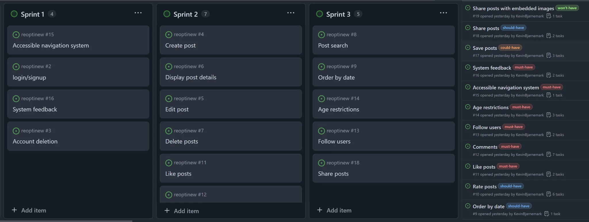
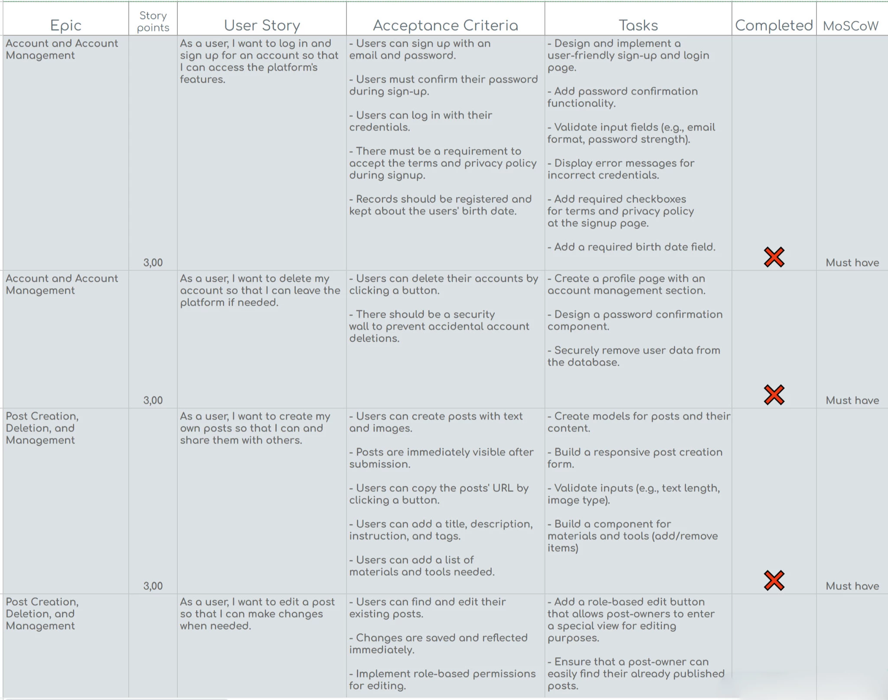
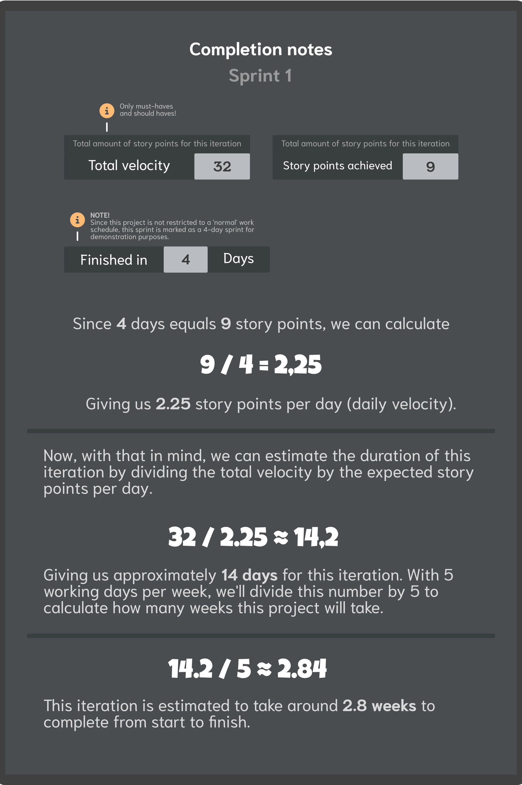

# First Iteration 🚀

## Table of Contents

- 🛠️ [Goal and Methods ](#goal-and-methods )
- 📉 [Summary](#summary)

## Goal and Methods 
The goal for this iteration is to build a working web application from the ground up using best practices. Here are some general tasks that this iteration focuses on.

- **Intuitive design**
- **Authentication system**
- **Creating, editing, sharing, rating, and deleting posts**

The project has been divided into **3 sprints** and these have been organized with GitHub Projects. The user stories have been labled with MoSCoW labels to better prioritize them. 

The initial product backlog (Google Sheets) can be found [here](https://docs.google.com/spreadsheets/d/1lR2MrSBqiQ_LjI35rekJWUB742Dfsd-08KdnPGidZPU/edit?usp=sharing). 

## Summary

Let's dig into the results of this interation.  

- **Planned scope:** 28 story points
- **Story points achieved:** 9

> ⚠️ **NOTE**  
> Typically, a single sprint is finished within 1-4 weeks. However, in this case, the sprints are designed to showcase the SCRUM methodology rather than conforming to conventional durations. Development has taken place over an extended and flexible timeline, outside standard working hours. The estimated time to implement features for each sprint have been estimated fictitiously to align with full-time schedules.

### Completion notes

Below you can find completion notes for all sprints.

#### Sprint 1

