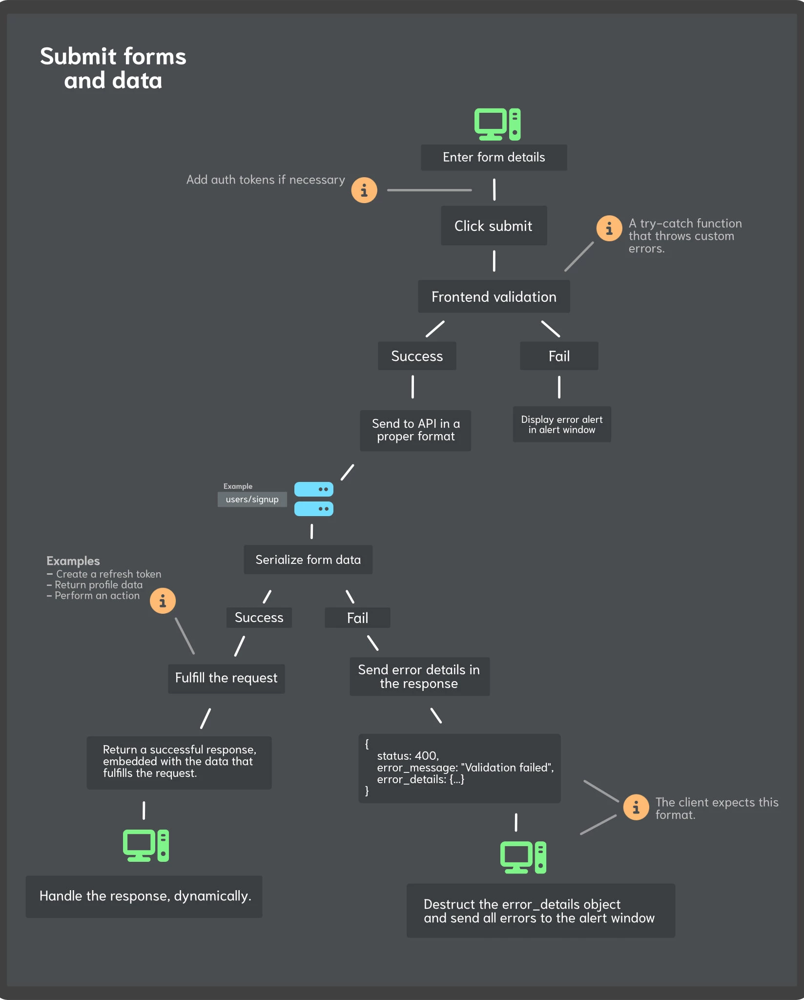

# Sprint 1

## Table of Contents

- 👮 [Authentication](#authentication)
- 🧭 [Navigation](#navigation)
- 👋 [System feedback](#system-feedback)
- ❌ [Account deletion](#account-deletion)

## Authentication

**Flowcharts** like the one below has been a part of the creation process. When the authentication system was developed, there was a desition of making a centralized system that handles errors and streamlines the process of submitting data to the backend. 

Relevant files:
- [Custom submit hook](../../../../src/hooks/forms/useSubmit.jsx) 
- [Sign up page](../../../../src/pages/signup/Signup.jsx)

## Navigation

## System feedback

## Account deletion
