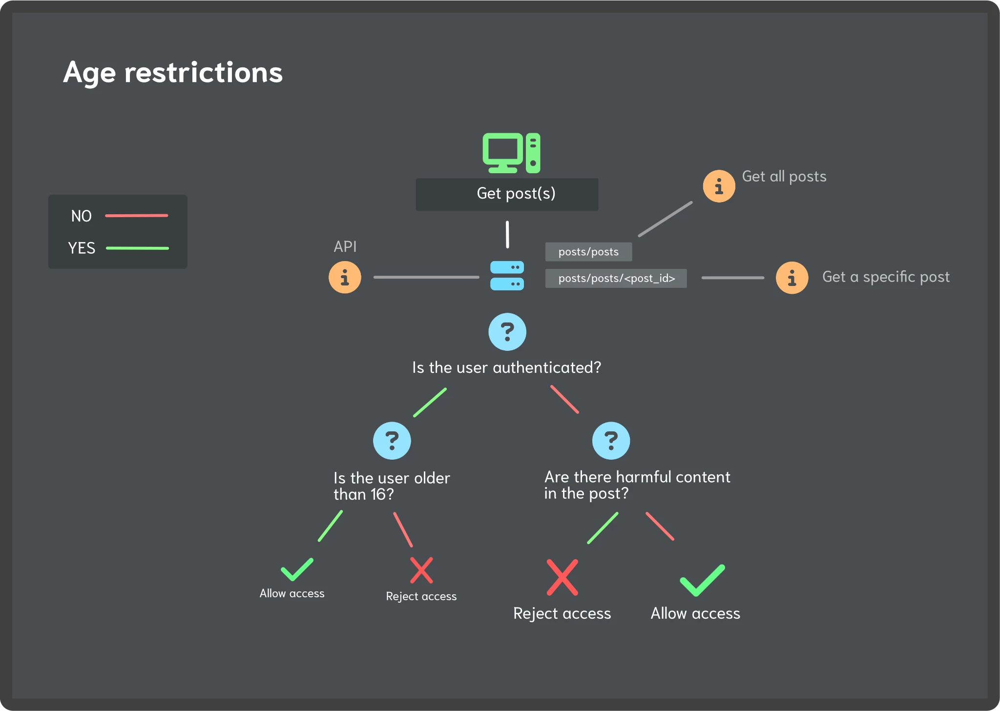

# Sprint 1

## Table of Contents

- 👮 [Age-restrictions](#authentication)

## Age restrictions

**Below** is a flow chart of the current age restriction rules implemented in the app. This system is built to allow new app visitors to have access to the main features whle keeping the app safe for children. This logic is handled by the backend.

> ⚠️ **Note**  
>   Users below **13** are also blocked from signing up, both on the frontend and backend.  

